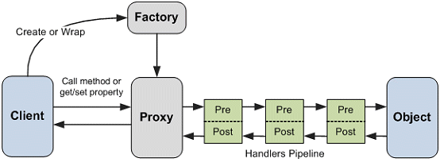

# aop

Using Aspect Oriented Programming (AOP) based Policy Injection for full Separation of Concerns (SoC)
By: Visar Elmazi

Writing enterprise software has always been both challenging and boring.  You need to ensure enterprise grade quality but at the same time you end up writing the same repetitive pieces of code which ensure this enterprise grade quality.
Speaking of quality and of the code that we write in enterprise software, it can be of 2 types:
-	Functional and
-	Non-functional (or cross-cutting as they sometimes call it)
The functional code is the usually the domain code, which includes the entities and operations on top of these entities. But the non-functional or the cross-cutting is usually not so much related to the actual domain logic, and such code is the code for security, logging, transactions, caching, failure, exceptions,  guards, etc.  
Mixing functional and non-functional code has 2 very big drawbacks:
1.	On the long run, it creates hardly maintainable code and
2.	It makes it very hard to differentiate between functional and non-functional code
Let’s see a simple example which saves a Sale or queues it for later, depending if it’s a planned future order.
        /// 

        /// Saves the sale or queues it for later
        /// 

        /// <param name="sale"></param>
        public void Save(Sale sale)
        {
            if(sale.IsValid())
            {
                //check if it's a scheduled sale
                if(sale.Date > DateTime.Now)
                {
                    sale.PutInQueue();
                }
                else
                {
                    //otherwise save
                    sale.Save();
                }
            }
        }
But this almost domain logic code lacks all the required non-functional aspects, starting with logging, validation, etc. So applying couple of these aspects, immediately this simple piece of code becomes much more complex and much harder to identify, read and maintain domain logic.
/// 

        /// Saves the sale or queues it for later
        /// 

        /// <param name="sale"></param>
        public void Save(Sale sale)
        {
            //guard against nulls aspect
            if(sale==null)
            {
                throw new ArgumentNullException("sale");
            }

            //authenticate aspect
            if(!Thread.CurrentPrincipal.Identity.IsAuthenticated)
            {
                throw new SecurityException("Not Authenticated", typeof(AuthenticationPermission));
            }

            //verify signature aspect
            if(sale.Signature.IsValid())
            {
                throw new SecurityException("Invalid Signature", typeof(ValidSignaturePermission));
            }

            //authorize aspect
            if (!Thread.CurrentPrincipal.IsInRole(this.GetType().FullName + "/" + "Save"))
            {
                throw new SecurityException("Not Authorized", typeof(AuthorizationPermission));
            }
			
			//check if method can be executed based on workflow/state machine rules
            if(!_workflow.CanExecute<SaleFeature, Sale.SaleState>("Save"))
            {
                throw new InvalidOperationException();
            }

            //method logging aspect
            _logger.Log("Entering Save method");

            //try/catch aspect 
            try
            {
                //validation aspect
                if(sale.IsValid())
                {
                    //run the block in transaction aspect
                    using (var scope = new TransactionScope())
                    {
                        //The business logic is hidden here 
                        //check if it’s a scheduled sale
                        if (sale.Date > DateTime.Now)
                        {
                          sale.PutInQueue();
                        }
                        else
                        {
                          //otherwise save
                          sale.Save();
                        }

                        scope.Complete();
						
						//send save completed event
                        _eventService.Publish(
							new MethodComplete<SaleFeature>("Save", sale));
                    }
                }
            }
            catch(Exception ex)
            {
                _logger.Exception(ex);
                throw; //usually we shouldn't catch all
            }

            //method finish aspect
            _logger.Log("Finishing Save method.");
        }

I have commented the different non-functional aspects so they are, in order of appearance:
1.	Null guard aspect
2.	Authenticate aspect
3.	Signature Validation aspect
4.	Authorization aspect
5.	Before Execute logging aspect
6.	Try/Catch block aspect
7.	Validation aspect
8.	Transaction aspect
o	Domain Logic goes here
9.	After Execute logging aspect

So these parts of code seem to wrap the domain code and execute in a sort of a pipeline. 
And sometimes, the worst thing that can happen is that you may end-up with a “conceptually” duplicated code across classes and methods, etc. 
For these reasons, Policy Injection or Aspect Oriented Programming can come to help to reduce the duplicated code and apply it as policies or aspects dynamically in build or runtime. 
 
 The main difference between Policy Injection and AOP is actually this:
-	AOP can be applied in build/compile time with code weaving concept with tools like PostSharp
o	It’s faster but the AOP tools changes the target code with static and compiled code
-	Policy Injection can be applied with dynamic proxies  in runtime
o	It’s slower but the code doesn’t change and much more flexible in runtime

So if we extract these aspects, we are able to apply these aspects to each called method in runtime in a pipeline form for all or some of the chosen methods. 

Thus, the contract of the given feature with applied aspects now looks like:
    
	[Aspect(typeof(NullGuardAspect))]
    [Aspect(typeof(LoggingAspect))]
    [Aspect(typeof(TransactionAspect))]
    [Aspect(typeof(WorkflowAspect))]
    [Aspect(typeof(EventAspect))]
    public interface ISaleFeature: IFeature<Sale>
    {
        [States(Sale.SaleState.New)]
        void Create(aop.domain.Sale sale);

        [States(Sale.SaleState.Normal)]
        [States(Sale.SaleState.Reserved)]
        void Save(aop.domain.Sale sale);
    }

Applying aspects through policy injection can be done in 2 methods:
-	By using the Decorator pattern or
-	By method interception with dynamic proxies

Using the decorator pattern is an effective way of doing this in design time, but eventually you end up writing a lot of decorators for all kinds of implementations and methods and that defeats the actual purpose of re-using and fully separating the concerns.
* You can visit the following discussion how to use the Decorator Pattern for Policy Injection AOP 
http://stackoverflow.com/questions/19526474/aop-implemented-with-the-decorator-pattern-over-a-generic-repository

Actually, I will follow up with Policy Injection with Decorator in another article, which can be especially useful in CQRS scenarios.

But in this article we are going to concentrate on policy injection of aspects using dynamic proxy in a pipeline of interceptors called before method call.

Let’s implement the above scenario by using Dynamic Proxy.

